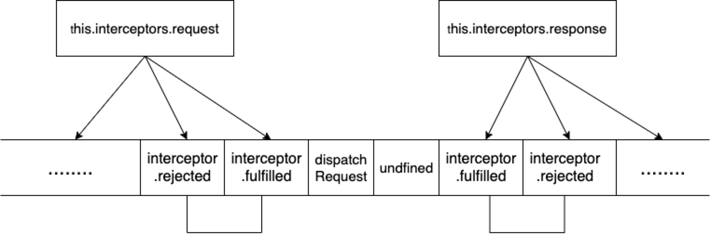

# Axios 源码分析

主要根据他在 npm 上的核心功能点，进行提问吧。可以先抛出几个问题

1、axios 的大致原理 or axios 的本质是什么
2、axios 是怎么实现请求拦截的
3、axios 时如何防止 xsrf 的
4、实际使用中遇到过的点

好，接下来围绕这些点对这个库简单分析一下，首先我们可以先写一个服务器，可以接收并打印前端请求的就可以

```js
const http = require('http');

const server = http.createServer((req, res) => {
  let buffers = [];
  req.on('data', function (chunk) {
    buffers.push(chunk);
  });
  req.on('end', function () {
    const reqBody = Buffer.concat(buffers).toString();
    console.log('reqBody', reqBody);
  });
  // 防止本地跨域，图方便就这么来了
  res.setHeader('Access-Control-Allow-Origin', '*');
  res.writeHead(200, { 'Content-typed': 'text/plain' });
  res.end('brelly');
});

server.listen(1234, () => {
  console.log('server is listening at 1234...');
});
```

然后写一个最简单的常规请求，到 axios 库里打 log 就可以了

```js
const axios = require('axios');

let a = 0;

axios
  .post('http://localhost:1234/', {
    data: a,
  })
  .catch((e) => e && console.log(e));
```

浏览器环境会略有不同,注意不要直接打开 html，我是直接 http-server 起了个静态服务器

```html
<!DOCTYPE html>
<html lang="en">
  <head>
    <meta charset="UTF-8" />
    <meta name="viewport" content="width=device-width, initial-scale=1.0" />
    <title>Axios try</title>
    <!-- 这里想分析axios原理的话,直接改打包好的文件就好,没变化记得清浏览器缓存 -->
    <script src="./node_modules/axios/dist/axios.js"></script>
  </head>
  <body>
    <script>
      document.cookie = 'XSRF-TOKEN=10086';
      let a = 0;
      axios
        .post('http://localhost:1234', {
          data: a,
        })
        .catch((e) => e && console.log(e));
    </script>
  </body>
</html>
```

## axios 的大致原理

先看下目录

```txt
├── CHANGELOG.md
├── LICENSE
├── README.md
├── UPGRADE_GUIDE.md
├── dist
|  ├── axios.js
|  ├── axios.map
|  ├── axios.min.js
|  └── axios.min.map
├── index.d.ts
├── index.js
├── lib
|  ├── adapters
|  |  ├── README.md
|  |  ├── http.js
|  |  └── xhr.js
|  ├── axios.js
|  ├── cancel
|  |  ├── Cancel.js
|  |  ├── CancelToken.js
|  |  └── isCancel.js
|  ├── core
|  |  ├── Axios.js
|  |  ├── InterceptorManager.js
|  |  ├── README.md
|  |  ├── buildFullPath.js
|  |  ├── createError.js
|  |  ├── dispatchRequest.js
|  |  ├── enhanceError.js
|  |  ├── mergeConfig.js
|  |  ├── settle.js
|  |  └── transformData.js
|  ├── defaults.js
|  ├── helpers
|  |  ├── README.md
|  |  ├── bind.js
|  |  ├── buildURL.js
|  |  ├── combineURLs.js
|  |  ├── cookies.js
|  |  ├── deprecatedMethod.js
|  |  ├── isAbsoluteURL.js
|  |  ├── isURLSameOrigin.js
|  |  ├── normalizeHeaderName.js
|  |  ├── parseHeaders.js
|  |  └── spread.js
|  └── utils.js
├── output.txt
├── package-lock.json
└── package.json

```

在入口文件处也就是 axios.js，他对外暴露了两个东西，一个是实例，一个是构造函数。一般用实例直接用就行了，如果对请求有一些上层封装就会使用 Axios 构造函数，使用 Axios 构造函数的意图就是希望可以用一些配置来覆盖默认配置。核心代码如下

```js
function createInstance(defaultConfig) {
  var context = new Axios(defaultConfig);
  var instance = bind(Axios.prototype.request, context);

  // Copy axios.prototype to instance
  utils.extend(instance, Axios.prototype, context);

  // Copy context to instance
  utils.extend(instance, context);

  return instance;
}

// 生成供使用的默认实例
var axios = createInstance(defaults);

// 暴露出构造函数
axios.Axios = Axios;

// 暴露用于创建新实例的方法
axios.create = function create(instanceConfig) {
  return createInstance(mergeConfig(axios.defaults, instanceConfig));
};
```

接下来的分析就在于核心文件 Axios.js，在 default.js 给 Axios 原型上挂了 n 多东西之后，他其实只做了两件事情

- 在 Axios 原型注册了有关 delete,get,head,options | post, put, path 的请求方法

- 在内部分别为请求和回复定义了请求拦截的管理对象

第一件事:

```js
utils.forEach(['delete', 'get', 'head', 'options'], function forEachMethodNoData(method) {
  /*eslint func-names:0*/
  Axios.prototype[method] = function (url, config) {
    return this.request(
      utils.merge(config || {}, {
        method: method,
        url: url,
      })
    );
  };
});

// 上下面的方法注册唯一的区别就是上面是带数据的，下面是不带数据的，其实下面方法就是在上面的基础上多传了个数据

utils.forEach(['post', 'put', 'patch'], function forEachMethodWithData(method) {
  /*eslint func-names:0*/
  Axios.prototype[method] = function (url, data, config) {
    return this.request(
      utils.merge(config || {}, {
        method: method,
        url: url,
        data: data,
      })
    );
  };
});
```

然后可以看下 Axios 里面请求的过程

```js
Axios.prototype.request = function request(config) {
  /*
    这段我给省略了，就是有关于config输入不合理时的一些特殊处理和操作
  */

  // Hook up interceptors middleware
  var chain = [dispatchRequest, undefined];
  var promise = Promise.resolve(config);

  this.interceptors.request.forEach(function unshiftRequestInterceptors(interceptor) {
    chain.unshift(interceptor.fulfilled, interceptor.rejected);
  });

  this.interceptors.response.forEach(function pushResponseInterceptors(interceptor) {
    chain.push(interceptor.fulfilled, interceptor.rejected);
  });

  while (chain.length) {
    promise = promise.then(chain.shift(), chain.shift());
  }

  return promise;
};
```

这里顺便解释一下拦截器的实现吧，这个请求的过程也是做了两件事: 把开发者定义的拦截器插到请求分发之前形成一个双向队列；双向队列的左侧作为 promise 的 resolve 函数，右侧作为 promise 的 reject 函数，把所有的函数组合转化成一个 promise 串行执行器，示意图如下。



所以 axios 请求最后返回的也是个 promise。到这里第二个问题就已经解释了。至于第一个问题，axios 的本质是什么，主要便体现在 dispatchRequest 里了.

首先他根据请求头对数据做了一些处理，这部分放后面说

```js
config.data = transformData(config.data, config.headers, config.transformRequest);

// Flatten headers
config.headers = utils.merge(
  config.headers.common || {},
  config.headers[config.method] || {},
  config.headers
);
```

主要看这一段

```js
var adapter = config.adapter || defaults.adapter;
return adapter(config).then(....)
```

axios 的本质分为两部分，一部分是浏览器环境中的封装好的 xhr 对象，一部分是 nodejs 环境中的 http/https[method]方法。

可以先看浏览器环境,封装了很多其实比较简单，就跟封 ajax 是一个步骤

```js
var request = new XMLHttpRequest();
......
request.open(config.method.toUpperCase(), buildURL(fullPath, config.params, config.paramsSerializer), true);
request.timeout = config.timeout
request.onreadystatechange = function handleLoad() {......}
request.onabort = function handleAbort() {......}
request.onerror = function handleError() {......}
request.ontimeout = function handleTimeout() {......}
......
request.send(requestData)
```

至于 nodejs 环境, 同样也是对 options 做了一定的基础处理，针对上面的例子 options 为以下

```js
{
  path: '/',
  method: 'POST',
  headers:
   { Accept: 'application/json, text/plain, */*',
     'Content-Type': 'application/x-www-form-urlencoded',
     'User-Agent': 'axios/0.19.2',
     'Content-Length': 10 },
  agent: undefined,
  agents: { http: undefined, https: undefined },
  auth: undefined,
  hostname: 'localhost',
  port: '1234'
}
```

本质很简短核心代码无非就是

```js
transport = isHttpsProxy ? httpsFollow : httpFollow;
......
var req = transport.request(options, function handleResponse(res) {
      if (req.aborted) return;

      // 正常这个请求回来的时候就是流式的，没错就是IncomingMessage
      // 下面的意思是在某几种数据格式情况下会将返回内容解压
      var stream = res;
      switch (res.headers['content-encoding']) {
      /*eslint default-case:0*/
      case 'gzip':
      case 'compress':
      case 'deflate':
        // add the unzipper to the body stream processing pipeline
        stream = (res.statusCode === 204) ? stream : stream.pipe(zlib.createUnzip());

        // remove the content-encoding in order to not confuse downstream operations
        delete res.headers['content-encoding'];
        break;
      }

      // return the last request in case of redirects
      var lastRequest = res.req || req;

      var response = {
        status: res.statusCode,
        statusText: res.statusMessage,
        headers: res.headers,
        config: config,
        request: lastRequest
      };

      if (config.responseType === 'stream') {
        response.data = stream;
        settle(resolve, reject, response);
      } else {
        var responseBuffer = [];
        stream.on('data', function handleStreamData(chunk) {
          responseBuffer.push(chunk);

          // make sure the content length is not over the maxContentLength if specified
          if (config.maxContentLength > -1 && Buffer.concat(responseBuffer).length > config.maxContentLength) {
            stream.destroy();
            reject(createError('maxContentLength size of ' + config.maxContentLength + ' exceeded',
              config, null, lastRequest));
          }
        });

        stream.on('error', function handleStreamError(err) {
          if (req.aborted) return;
          reject(enhanceError(err, config, null, lastRequest));
        });

        // 这里面就是关键的如何把流式的数据转化成字符串，和server.js里面的路子其实是一样的
        stream.on('end', function handleStreamEnd() {
          var responseData = Buffer.concat(responseBuffer);
          if (config.responseType !== 'arraybuffer') {
            responseData = responseData.toString(config.responseEncoding);
          }

          response.data = responseData;
          settle(resolve, reject, response);
        });
      }
    });
```

简单解释一下，根据当前协议头对应选用 Follow Redirect 中的 http 或 https 部分，这个模块其实就是原生 http、https 库上面封装了一层，支持重定向。

至此问题一也就是 axios 的本质也得到了解答

## axios 与 csrf

一直好奇挂在 default 默认配置(后来合到 config 里面的)这两个变量的用处是什么

```js
xsrfCookieName: 'XSRF-TOKEN',
xsrfHeaderName: 'X-XSRF-TOKEN',
```

```js
if (utils.isStandardBrowserEnv()) {
  var cookies = require('./../helpers/cookies');

  // Add xsrf header
  var xsrfValue =
    (config.withCredentials || isURLSameOrigin(fullPath)) && config.xsrfCookieName
      ? cookies.read(config.xsrfCookieName)
      : undefined;

  if (xsrfValue) {
    requestHeaders[config.xsrfHeaderName] = Value;
  }
}
```

代码的逻辑很简单，其实就是如果 cookie 中包含 XSRF-TOKEN 这个字段，就把 header 中 X-XSRF-TOKEN 字段的值设为 XSRF-TOKEN 对应的值。

那这么做的目的是什么

**对于你的网站，只有你的请求会被后端识别**

cp 并结合一段网上常说的 csrf 实际例子说明下

>

    CSRF攻击攻击原理及过程如下：

        1. 用户C打开浏览器，访问受信任网站A，输入用户名和密码请求登录网站A；

        2.在用户信息通过验证后，网站A产生Cookie信息并返回给浏览器，此时用户登录网站A成功，可以正常发送请求到网站A；

        3. 用户未退出网站A之前，在同一浏览器中，打开一个TAB页访问网站B；

        4. 网站B接收到用户请求后，返回一些攻击性代码，并发出一个请求要求访问第三方站点A；

        5. 浏览器在接收到这些攻击性代码后，根据网站B的请求，在用户不知情的情况下携带Cookie信息，向网站A发出请求。网站A并不知道该请求其实是由B发起的，所以会根据用户C的Cookie信息以C的权限处理该请求，导致来自网站B的恶意代码被执行。

现在网站 B 发起的请求里虽然有 cookie 但是并不包含前端和后端约定好的 header 中的 X-XSRF-TOKEN 字段，所以请求会失败，这样便防止了 csrf 攻击。

## 实战中需要注意的点

#### 前后端联调的数据格式

和后端接口联调的时候需要注意 Content-type,springboot 对 application/x-www-form-urlencoded 和 application/json 的解析方式是不同的，因为源码内部对数据格式做了处理，所以通常不建议在 axios 的 config 里面去修改 Content-type

```js
if (utils.isArrayBufferView(data)) {
  return data.buffer;
}
if (utils.isURLSearchParams(data)) {
  setContentTypeIfUnset(headers, 'application/x-www-form-urlencoded;charset=utf-8');
  return data.toString();
}
if (utils.isObject(data)) {
  setContentTypeIfUnset(headers, 'application/json;charset=utf-8');
  return JSON.stringify(data);
}
```

如果和后端约定的 Content-type 是 json，那么发过去的具体内容应该是

```js
{
    id: 1,
    info: {
        name: 'brelly',
        height: 172
    }
}
```

这个样子.

否则如果是 x-www-form-urlencoded,那请求体会长这个样子。

```js
id = 1 & info = { name: 'brelly', height: 172 };
```

#### cancel

其实这个特性用的不是很多，遇到需要 cancel 掉 axios 请求的情形差不多是这样: 某个组件发起了个请求还没有拿到请求的结果的时候，这个组件就 unmount 掉了，或者是发生页面跳转时，会报警告。。。不过防止这种 case 的方案大多数是在请求外做的，所以便很少用到本身的 cancel。

源码中对于 cancel 的实现就是如果发现 config 中有 cancelToken 就 abort 掉请求，并 reject 掉。

**xhr**

```js
if (config.cancelToken) {
  // Handle cancellation
  config.cancelToken.promise.then(function onCanceled(cancel) {
    if (!request) {
      return;
    }

    request.abort();
    reject(cancel);
    // Clean up request
    request = null;
  });
}
```

**node**

```js
if (config.cancelToken) {
  // Handle cancellation
  config.cancelToken.promise.then(function onCanceled(cancel) {
    if (req.aborted) return;

    req.abort();
    reject(cancel);
  });
}
```

参考资料

[CSRF/XSRF 攻击与防御](https://www.jianshu.com/p/401f5642ea63)
[axios 全攻略](https://www.cnblogs.com/libin-1/p/6607945.html)
