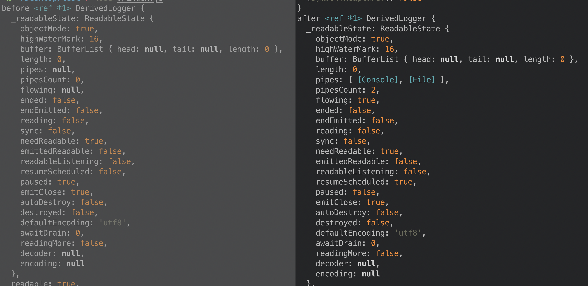

# winston日志方案及原理(下)

在一些探索无果之后，差点儿放弃探索winston的原理了，如上篇所说注意力不再放在readable-stream上是因为

```js
// const { Stream, Transform } = require('readable-stream');
const {Stream, Transform} = require('stream');
```

做了如上修改后结果并没有改变，在探索winston之前看了下官方文档，最起码知道了如下关于stream的基础知识。

## stream

stream模块为nodejs的流的功能提供了强大的api接口，nodejs中有很多流的实例比如对http服务器的请求，进程的输出等等，流一般分为可读流和可写流，当然也存在既可读又可写的流，所有的流都是eventemitter的实例。流的基础数据单位是string或buffer(含Unit8Array)。如果希望流可以和其他js数据类型一起使用，需要在初始化时将其设定为Object mode ，但是并不建议对已有的流进行类型转换

对于正常流，highwatermask决定存储的字节总数，对于对象模式的流则是决定存储流的个数。

对于readable流有一定的缓存区，对于writable流也有一定的内存缓冲区。

一共具有四种流
readable，
writable，
Duplex，
Transform
其中socket就是典型使用Duplex的技术


### Writable Stream

可写流

### Readable Stream

增加readable特性会阻止流的流动性，直至去掉后并存在‘data’事件监听时才会继续流动
readable监听第一次回调发生在data之后，强调数据可用

pipe相当于时一个管道，负责不同流之间的数据流通

举例

```js
const fs = require('fs');
const r = fs.createReadStream('file.txt');
const z = zlib.createGzip();
const w = fs.createWriteStream('file.txt.gz');
r.pipe(z).pipe(w);
```

一般情况下 writableStream会自动关闭除非有错误发生，这个时候一般需要手动关闭以防内存泄露
setCoding会使可读流转换成某种编码的字符串

### Duplex Stream

全双工的流，既可读又可写。

### Transform Stream

在全双工流的基础上，结果往往通过一些固定的处理步骤以便得到想要的结果的流


### 接下来我们换一种角度去看winston

其实winston里面的write方法就是继承了readable-stream里面的transform流。

我们可以先修改下我们用来看源码的运行的代码

```js
const winston = require('winston');

const transports = {
  console: new winston.transports.Console({ level: 'warn' }),
  file: new winston.transports.File({ filename: 'combined.log', level: 'error' })
};
 
const logger = winston.createLogger({
  transports: [
    transports.console,
    transports.file
  ]
});

// console.log('logger', logger);
 
// logger.info('Will not be logged in either transport!');
// transports.console.level = 'info';
// transports.file.level = 'info';
// logger.info('Will be logged in both transports!');

transports.console.level = 'info';
logger.log('info', 'brellyliaoliao');
```

其实就是先去读取两种通道一个是console，一个是file，把两个通道的内容加工到logger实例里面，可以看到logger的前后变化无非就是ReadableState里面的pipe增加了两个函数,一个是Console, 一个是File.



为了最大化地简化并模拟winston的整个过程，试图从源码里抽出来核心逻辑,即writable流仍采用原来的实现

```js
const winston = require('winston');
const { Transform } = require('stream');

const LEVEL = Symbol.for('level');
const MESSAGE = Symbol.for('message');

const consoleWritable = new winston.transports.Console({ level: 'info' });
const FileWritable = new winston.transports.File({ filename: 'test.log', level: 'info' });

// console.log('consoleWritable', consoleWritable);


class myTransform extends Transform {
  constructor(options) {
    super(options);
  }
  log(level, msg) {
    const info = {[LEVEL]: level, level, message: msg};
    info[MESSAGE] = JSON.stringify(info);
    this.write(info);
  }

  _transform(chunk, enc, callback) {

    try {
      this.push(chunk);
    } catch (ex) {
      throw ex;
    } finally {
      // eslint-disable-next-line callback-return
      callback();
    }
  }
}

const transFormInstance = new myTransform({
  objectMode: true,
  needReadable: true,
});

transFormInstance.levels = {
  error: 0,
  warn: 1,
  info: 2,
  http: 3,
  verbose: 4,
  debug: 5,
  silly: 6,
};

transFormInstance.pipe(consoleWritable);

// console.log('transFormInstance', transFormInstance);
transFormInstance.log('info', 'brelly liaoliao');

```

正常的以流的形式打印出了相关内容，现在来看已经初步实现了console的功能了。

现在我们把winston的壳子撤下去,单纯实现一个简单版的，60行左右

```js
// const winston = require('winston');
// const consoleWritable = new winston.transports.Console({ level: 'info' });
// const FileWritable = new winston.transports.File({ filename: 'test.log', level: 'info' });

const { Transform, Writable } = require('stream');
const os = require('os');

// 先封装一个可以调用原型链上log方法的writable流
class myWritable extends Writable {
  constructor(options) {
    super(options);
  }
  _write(chunk, encoding, callback) {
    return this.log(chunk, callback);
  }
}

// 没错这个就是针对具体功能的上层封装
class Console extends myWritable {
  constructor(options = {}) {
    super(options);
  }
  log(info, callback) {
    info = typeof info !== 'string' ? info.toString() : info;
    (console._stdout && console._stdout.write(`${info}${os.EOL}`)) || console.log(info);

    if (callback) {
      callback(); // eslint-disable-line callback-return
    }
  }
}

const consoleWritable = new Console();

// transform流就是把变量直接导进wriable流
class myTransform extends Transform {
  constructor(options) {
    super(options);
  }
  log(msg) {
    this.write(msg);
  }

  _transform(chunk, enc, callback) {
    try {
      this.push(chunk);
    } catch (ex) {
      throw ex;
    } finally {
      // eslint-disable-next-line callback-return
      callback();
    }
  }
}

const transFormInstance = new myTransform({
  objectMode: true,
  needReadable: true,
});


// 这两个顺序无所谓
transFormInstance.pipe(consoleWritable);
transFormInstance.log('brelly liaoliao');

```

到此便实现了一个对winston的一个最小模拟。对于console是这样，对于file流程也是差不多的，只是对流的处理稍微复杂点儿，感兴趣的同学可以接着封装一下。

至此总算是通过一个虽冷门但是好用的日志库实现了console.log

(听起来好卑微呀，汗。。。。。)


**参考**

[node读写流及pipe的应用](https://blog.csdn.net/qq_41681675/article/details/80943782?utm_source=blogxgwz0)