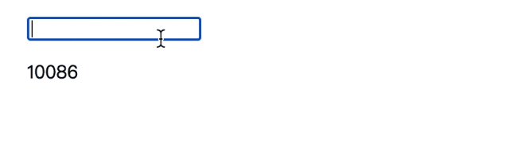

## 防抖节流那些事

#### debounce && throttle

以下是原文中对debounce相关的注释
    
    
> 创建一个能延迟运行指定`func`的防抖函数，直到距离上次调用该防抖函数时间不小于`wait`时，防抖函数内的`func`才会真正调用，或者也可等到浏览器下一帧绘制的时候。本防抖函数有一个`cancel`方法去取消延迟的`func`唤醒并且有`flush`方法去立刻唤醒他们.提供options参数去表明指定`func`函数是在指定`wait`时间的前沿还是后沿执行。`func`函数是由最后一次提供给防抖函数的参数们触发的，随后对防抖函数调用都将返回上次函数调用的结果。注意，如果`leading`和`trailing`参数是true，`func`会在时间结束点的后沿触发，除非防抖函数在wait时间段里被触发多次，。如果在支持requestAnimationFrame的环境中并没有提供`wait`参数，那么`func`将会在下一帧绘制的时候被调用，一般是16ms。


然后是原文中对throttle相关的注释

> 创建一个节流函数，这个节流函数在每段`wait`时间段内只触发依次。节流函数有个`cancel`方法去取消被延迟的`func`调用，并且有个`flush`方法去立刻触发他们。这里提供了`options`去表示`func`是在`wait`时间段的前沿还是后沿触发。`func`是由最后一次提供给节流函数的参数们所触发的。接下来对节流函数的调用都将返回最后一次`func`调用的结果值。如果leading和trailing参数为true，`func`会在时间段的后沿触发，除非在`wait`时间内节流函数被触发了不止一次


说了这么多理论debounce的过程就像是这样



    

看下我们喜闻乐见的lodash中的实现，他相对于我们上边的实现，有些不同

1、多了一些配置项的处理，
比如leading、trailing和maxwait，分别用来指定函数在每次等待开始时调用、每次结束时被调用和最大等待时间，其中第三个保证在一定时间内一定能够执行这个函数，所以其实这个就是throttle 嘿嘿。

2、总体上的细节补充
比如如果没有传时间，就默认按照下一次屏幕刷新的时间作为等待时间来做防抖

```js
function startTimer(pendingFunc, wait) {
    if (useRAF) {
      root.cancelAnimationFrame(timerId)
      return root.requestAnimationFrame(pendingFunc)
    }
    return setTimeout(pendingFunc, wait)
}
```


所以在看过了lodash实现的原理后得到的收获就是节流是一种特殊的防抖，可以借鉴着把我们当前的代码优化下。

```js
const debounce = (fn, time = 1000) => {
  let timer;
  return function(...args) {
    clearTimeout(timer);
    timer = setTimeout(() => fn.apply(this, args), time);
  }
}

const throttle = (fn, wait = 1000) => {
  let timer, lastTime, throttleBl;
  return function(...args) {
    if (!throttleBl) {
      fn.apply(this, args);
      lastTime = Date.now();
      throttleBl = true;
    } else {
      clearTimeout(timer);
      timer = setTimeout(() => {
        if (Date.now() - lastTime >= wait) {
          fn.apply(this, args);
          lastTime = Date.now();
        }
      }, Math.max(wait - (Date.now() - lastTime), 0));
    }
  }
}


const tell = (name) => console.log(`im ${name}`);

const dTell = debounce(tell);

dTell('brelly liaoliao');


const tTell = throttle(tell, 2000);
tTell('brelly liaoliao');
tTell('brelly liaoliao');
tTell('brelly liaoliao');
tTell('brelly liaoliao');
tTell('brelly liaoliao');
tTell('brelly liaoliao');
// setTimeout(() => tTell('brelly liaoliao'), 200);

```

#### 实战

就拿hook中的debounce来试试吧，因为现在普遍工程里都是带ts的，所以尝试下debounce。
我们可以先来看一个case，就是我们直接用传统的debounce函数来包裹hooks操作会怎么样。

先给一个测试用例吧。

```js
import React, { FC, ChangeEvent, useState, useEffect } from 'react';
// import debounce from '../../hooks/debounce';

const debounce = (fn: any, ms = 0) => {
  let timeoutId: any;
  return function(this: any, ...args: any) {
    clearTimeout(timeoutId);
    timeoutId = setTimeout(() => fn.apply(this, args), ms);
  };
};


const MdTh: FC = () => {
  const [name, setName] = useState<string>('');
  const [intro, setIntro] = useState<string>('');

  const handleChange = ({
    target: { value },
  }: ChangeEvent<HTMLInputElement>) => {
    setName(value);
  };
  
  const dSetIntro = debounce(setIntro, 500);

  useEffect(
    () => {
      dSetIntro(10086+ ' ' + name);
    },
    [name],
  )

  return (
    <div>
      <input type="text" value={name} onChange={e => handleChange(e)} />
      <p>{intro}</p>
    </div>
  );
};

export default MdTh;


```

我们会发现使用传统的debounce会发生错误，实际效果如gif。


这是为啥呢，打印下其中的timeoutId就会发现每次都是undefined，根本就没留住，所以这个debounce函数就相当于是单纯地给这个函数加了个setTimeout。这是为什么呢？我们可以在当前组件的return之前的部分加一个打印

> console.log('rerender')

会发现控制台会打好多次这个rerender。我们接着可以对比一下传统的写法


所以其实只要input内发生变化，这里的debounce函数就重新定义了一回，中间的timeoutId就被重新初始化了，这就是问题所在。给个非hooks下debounce调用的实例

```js
import React, {Component} from 'react';
// import debounce from 'lodash/debounce';


const debounce = (fn: any, ms = 0) => {
  let timeoutId: any;
  console.log('debounce defined');
  return function(this: any, ...args: any) {
    console.log('timeoutId', timeoutId);
    clearTimeout(timeoutId);
    timeoutId = setTimeout(() => fn.apply(this, args), ms);
  };
};

class DtTry extends Component<any, any> {
  state = {
    text: ''
  }

  send = (text: string) => console.log(text);
  dSend = debounce(this.send, 500);

  handleChange = async ({target: {value}} : {target: any}) => {
    this.setState({text: value}, () => {
      this.dSend(value);
    });
    console.log('done');
  }
  render() {
    console.log('rerender');
    return (
      <input type="text" onChange={e => this.handleChange(e)} value={this.state.text} />
    )
  }
}

export default DtTry;

```

debounce并不会被刷新，所以符合了常规我们的要求，所以为了解决这个问题，其实只要我们通过useRef保留一份快照把他保留下来就好，下面是实际上的写法。

```ts
import { useRef, useEffect, useCallback, DependencyList } from 'react';

/**
 * @description: 用于函数节流的hooks
 * @param {any} fn 用于节流的函数
 * @param {number} delay 延迟时间
 * @param {array} dep 依赖项，一般应该不会需要，默认为[]
 * @return: 节流后的函数
 */
function useDebounce(fn: Function, delay: number = 0, dep: DependencyList = []) {
  const { current } = useRef<{ fn: Function; timer: NodeJS.Timeout | null }>({
    fn,
    timer: null,
  });
  useEffect(() => {
    current.fn = fn;
  }, [fn]);

  return useCallback(function (this: any, ...args) {
    if (!args[0]) {
      return current.fn.call(this, ...args);
    } else {
      if (current.timer) {
        clearTimeout(current.timer);
      }
      current.timer = setTimeout(() => current.fn.call(this, ...args), delay);
    }
  }, dep);
}

export default useDebounce;

```


接下来补补图，就是throttle的部分了,这部分基本就直接cp了，看过的实现的最漂亮的throttle代码.


```ts
import {useRef, useEffect, useCallback, DependencyList} from 'react';

function useThrottle(fn: Function, delay: number = 0, dep: DependencyList = []) {
  const { current } = useRef<{
    fn: Function,
    timer: NodeJS.Timeout | null
  }>({ fn, timer: null });
  useEffect(function () {
    current.fn = fn;
  }, [fn]);

  return useCallback(function f(this: any, ...args) {
    if (!current.timer) {
      current.timer = setTimeout(() => {
        delete current.timer;
      }, delay);
      current.fn.call(this, ...args);
    }
  }, dep);
}

export default useThrottle;
```

这个例子是前沿触发的，但是即使改成后沿触发也差不多

```js
return useCallback(function f(this: any, ...args) {
    if (current.timer) {
      return;
    } else {
      current.fn.call(this, ...args);
      current.timer = setTimeout(() => {
        delete current.timer;
      }, delay);
    }
  }, dep);
```

感觉节流的场景更适用于一种频繁发起请求或者是重复做同一件事情的场景，因为在同一时间段里，直观观察会"有丢失".


参考文章

[React hooks 怎样做防抖](https://juejin.im/post/5ea04691e51d4547126400c7)