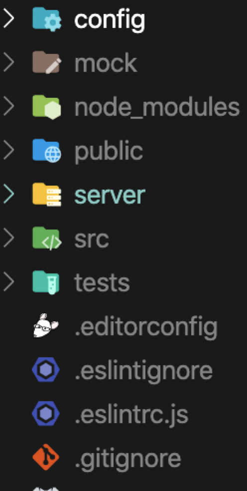
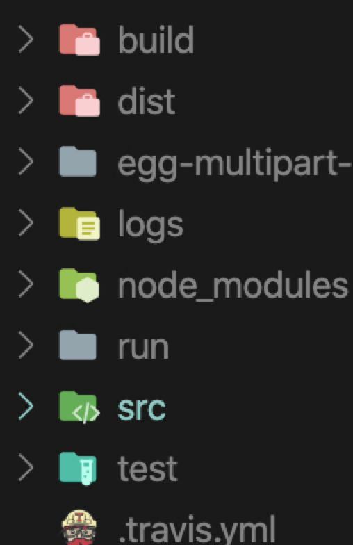
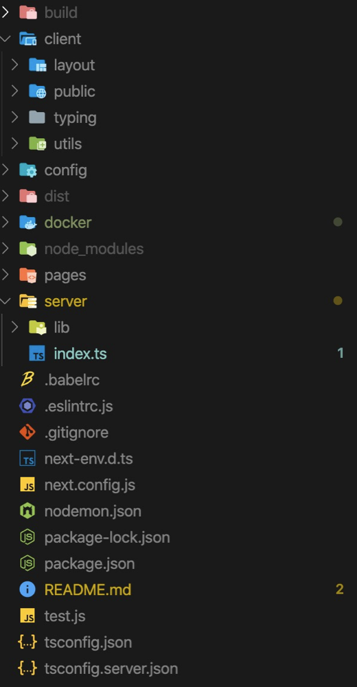

# 同构与异构

前端架构。
从写前端的角度上来讲，无非分为客户端写法和服务端写法。
从整体架构的角度上说，无非分为异构写法和同构写法。

## CSR与异构

### csr背景

CSR 也就是 Client Side Rendering, 顾名思义就是客户端渲染。而异构指的便是前端一套，后端一套，二者不相重复，相辅相成。
在遥远的以前，web 页面的写法可能是 jsp 等，服务端出一个 html，然后通过 js、jQuery 等直接操作 dom 的方式生成一个最后的 html 并通过 ng 传入到用户手里。
后来人们主张了前后端分离，于是有了 React/Vue 通过 webpack 等打包工具打包成静态资源后打向后端提供的 web 服务，由 ng 或后端提供访问。

现实情况是如果我们既是前端工程师，也负责工程的部署和运行的话，怎么去做异构呢？ 目前所采用的异构方案就是一套工程分为两层，我们以炙手可热的阿里系框架umi和midway作为示例讲解(这里其实用什么都是一样的，前端都是通过打包工具打包成静态文件，后端是koa、midway、nest都行，毕竟根源都是express hhh)。

### csr典型示例

首先先展示一个大体上的目录配置如下
外层是web

内层是server

server层是最后运行的web应用，build是外层web的打包产物，而dist是后端代码的打包产物，(如果要想支持history的router, build的位置会有更换，请见下文)


#### dev模式

umi层面运行umi dev，midway层面midway-bin dev 即可。一般开发流程是umi只管客户端开发，所有的渲染和数据请求由浏览器执行，并不用考虑代码可能在node环境下运行的一些问题，相对简单，这一点和传统的csr开发并无差别。前端部分发起的请求会通过umi proxy，直接打到后端运行端口下对应的path，从而完整地实现了前后端。

#### 生产环境

umi运行umi build之后生成一份build打包文件，里面有着常见的三件套，index.html,umi.js,umi.css ,然后通过egg-static 提供静态服务，来对打包的文件进行访问，这里前端用了hash router， 所以最后形成导致的url是这样的

```txt
https://sth/index.html/#/user/login
```

及其地，emmmm，不优雅，那我们怎么来解决这个问题呢？

我们先要问一个面试里经常会问到的问题，为什么说，相比hash router ，history需要后端的支持呢？

#### hash router与history router

hash 是用的 location.hash 来做的处理，前端路由在跳转的时候不会向后端发起请求，直接拿到了所有的东西。
history 利用了 HTML5 History Interface 中新增的  pushState()  和  replaceState()  方法。（需要特定浏览器支持）
这两个方法应用于浏览器的历史记录栈，在当前已有的  back、forward、go  的基础之上，它们提供了对历史记录进行修改的功能。只是当它们执行修改时，虽然改变了当前的 URL，但浏览器不会立即向后端发送请求。但是人家害怕刷新啊，刷新的时候会向后端发起请求，如果后端不支持的话就会 gg，所以一般会默认走一个路由不匹配返回首页的操作，这样就可以正常访问了

#### 合理的异构

所以这里我们可以尝试一下umi + midway 业务独立，如何打造一个相对完美的异构项目

想用history router其实是个漫长的过程

一开始，想直接读取前端生成的html

```js
@get('/*')
  async all() {
    this.ctx.response.type = 'html';
    this.ctx.response.body =                        fs.createReadStream(`${cwd}/build/index.html`);
  }
```

这个处理方法有个问题就是如果html要引入同级目录下的一些其他静态资源，由于(/*)的干预这些资源也引不进来，所以这种方案可能不是那么科学，直到在issue下面发现有这么一条：https://github.com/eggjs-community/egg-view-static/issues/2

于是去看了egg-view-static,摸索出了后端支持前端history router的方法

__好，然后我们可以进入正题了__

首先用umi脚手架生成一个umi项目（见umi 3官网）,正常pages下写几个文件，发现没啥问题，可以做配置如下

```js
export default {
  publicPath: '/',
  outputPath: './server/src/app/public',
  targets: {
    ie: 11,
  },
  proxy: {
    "/api": {
      target: "http://localhost:7001",
      changeOrigin: true,
    }
  }
};
```

运行npm run build之后，现在config里面配置

```js
config.view = {
    defaultViewEngine: 'static',
    mapping: {
      '.html': 'static',
    },
  }
```

plugin.ts中加入

```js
viewStatic:{
    enable: true,
    package: 'egg-view-static'
  }
```

然后在controller里面

```ts
import { Context, inject, controller, get, provide } from 'midway';

@provide()
@controller('/')
export class HomeController {

  @inject()
  ctx: Context;

  @get('/')
  async index() {
    this.ctx.body = 'hello world'
  }
  @get('/*')
  async render() {
    await this.ctx.render('index.html');
  }
}

```

然后运行项目访问，在后端的支持下，前端静态资源的history router在刷新时，向后端发起请求，返回的还是前端已经打包好的html，这样便实现了那个经典的问题:"为什么说history router 需要后端的支持"


---

## SSR 与同构

SSR 也就是 Server Side Rendering，顾名思义就是服务端渲染。同一套代码会在服务端和客户端执行两次，讲究谁快谁先来。在服务端的时候主要做数据拉取，页面渲染(字符串)、数据灌入等操作，等这些结果到达了客户端，客户端会接着运行 ComponentDidMount 后面的生命周期，走一些客户端交互和数据逻辑变化等功能(比如dom上的点击事件等)。我举两个例子去比较市面上的同构方案吧

### beidou

beidou可以说是同构的比较早期的方案之一了，开始是非常优秀的尝试，但到后来总体来说感觉很重，技术栈在逐渐变旧，没有持续翻新和进一步升级，各种目录配置十分分散，感觉对设计模式的拓展性过于要求反倒失去灵活性。

在dev模式下经常还出现warning的情况，即客户端和服务端渲染结果不一致，这个其实是因为hydrate会比较不同并刷新，他所配的webpack dev模式下使用hydrate，前端会更新后端不会因此就会出现不一致的情况而报warning。这个解决方案其实加上一句

> const renderFunction = module.hot ? ReactDOM.render : ReactDOM.hydrate;

就可以搞定了。

后续大佬们出了一款框架egg-ssr好像是非常不错的选择，可以看下


### next.js

个人觉得比较好的实践是官方examples里面的是把next作为koa的一个中间件，web应用通过koa来启动，启动之后由koa来控制渲染和中间层逻辑。
目录结构差不多是这样


官网给出的例子比较清晰，比较有借鉴意义，有个官网上比较重要的特性就是pages下面的react组件或者说各个路由对应的各个页面.
__如果想走前端api转发，可以在pages文件夹里面设置一个api文件夹进行转发__。

node中间层部分

```ts
import next from 'next';
import { Context, Next } from 'koa';

import Koa from 'koa';
import Router from 'koa-router';

import getPort from './lib/getPort';

const cloudPort = getPort();
const port = parseInt(cloudPort || '80', 10);
const dev = process.env.NODE_ENV !== 'production';
const app = next({ dev });
const handle = app.getRequestHandler();

app.prepare().then(() => {
  const server = new Koa();
  const router = new Router();

  // 挂载中间件

  router.all('*', async (ctx: Context) => {
    await handle(ctx.req, ctx.res);
    ctx.respond = false;
  });

  server.use(async (ctx: Context, next: Next) => {
    ctx.res.statusCode = 200;
    await next();
  });

  server.use(router.routes());
  server.listen(port, () => {
    console.log(`> Ready on http://localhost:${port}`);
  });
});

```

因为dev模式和production模式，next已经封装得很好了，可以说是真的开箱即用，所以就不加以赘述啦，文档很清楚


## 前端架构应该考虑哪些

最后总结下合理的前端架构应该思考那些问题

#### 理想的to c端项目框架

- 配置简单
- 构建、运行速度快
- 写起来完全不会受到过于复杂的目录的阻碍，业务逻辑独立且十分清晰，csr和ssr无缝切换
- 完全ts，eslint + prettier代码规范
- 支持组件单测
- 完整的日志系统
- 热更新+非常严格的报错机制
- 业务和架构之间可以分离开来


#### 理想的to B端项目框架

- 前后端分离
- 微前端体系，不同的项目走不同的打包
- router美好
- 严格ts检查
- 单测体系